# [IT 몬스터즈] 맞춤형 IT개발 팀 빌딩 서비스
[서비스링크](https://it-monsters.co.kr)

# 목차

---

1. 소개
- 우리팀 소개

2. 프로젝트
- 프로젝트소개
- 기술스택
- 기술스택 도입배경
- 트러블슈팅
- 주요기능

3. 팀원 개별 소개

# 1. 소개

---

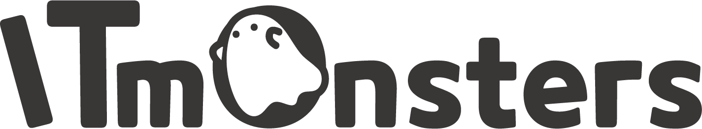

### **IT몬스터즈는 도전하는 개발자와 개발팀이 서로 믿을 수 있는 팀 빌딩 환경을 제공합니다.**

## 우리팀 소개

프로젝트 명 : IT 몬스터즈

프로젝트 형태 : 수강생 프로젝트

프로젝트 기간 : 2022년 8월 28일 ~2022 년 10월 8일

### 팀원

**Back-End** : 전지만(Project Leader) 이원규 이동규 김진무

**Front-End**: 노진서(Vice Leader) 원중희 황태영

**UI-UX Design**: 윤정아

**Marketing Design**: 김소정

# 2. 프로젝트

---

### 프로젝트 소개

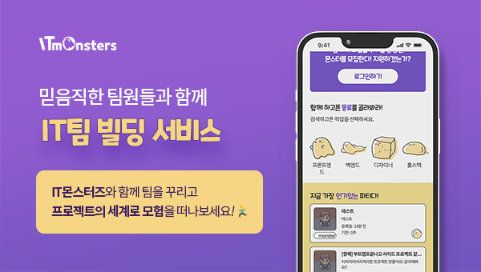

> 아무나 매칭되는 랜덤 매칭에 지겨우신 프로젝트 팀!
>
>
> **소통이 안되는 팀원에게 지쳐버린 프로젝트 팀!**
>
- 이제 **필요한 능력**을 가진 참가자를 게시글을 통해 모집해보세요!
- 팀장님께서는 참가신청을 통해 요청한 사람의 **전문성**을 확인하고 능력을 갖춘 분이라면 **수락**을 통해 팀으로 **합류**가 가능합니다!

> 내 능력을 제대로 발휘할 수 있는 팀을 찾고 싶은 개발자!
>
>
> **기가막힌 아이디어를 찾아 도전하고 싶은 개발자!**
>
- 자신의 기록들을 공유하고 **전문성**을 뽐내보세요.
- **Github, Notion, Blog** 링크를 공유하고 추천을 받아 **랭커**가 될 수 있습니다!
- 마음에 드는 팀에 참여하고, 완료한 프로젝트는 **커리어**로 남겨보세요!

**프로젝트 Github**

BackEnd

[GitHub - Camof1ow/itMonsters](https://github.com/Camof1ow/itMonsters)

FrontEnd

[GitHub - bennoholik/IT-Hunters: IT-Monsters](https://github.com/bennoholik/IT-Hunters)

### 랜딩 페이지 (Web/ Chrome)

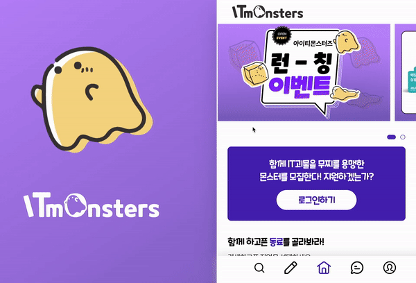

### 기술스택

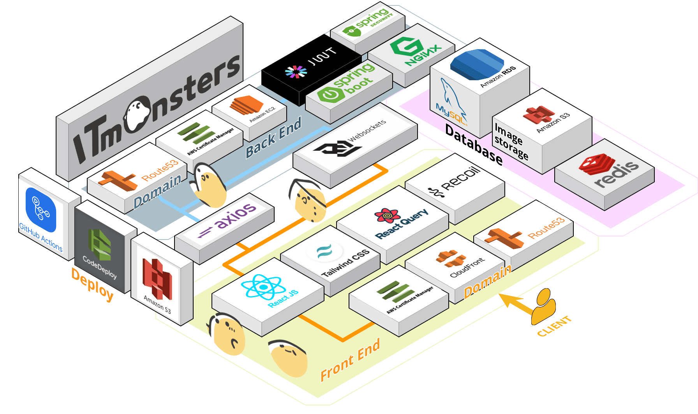

Tools

 Jmeter

FrontEnd

BackEnd

QueryDSL

Deploy

EC2,CloudFront,Route53,certificate Manager, S3,codeDeploy,ELB

### 🛠기술 스택 도입 배경

- ✔️**FrontEnd**

    **TypeScript**
    
    - 코드 작성시 형변환에 관련한 오류를 명확한 타입 지정을 통해 미리 예방 가능하므로 생산성의 향상을 도모하기 위해 도입하였습니다
    
    **ReactQuery**
    
    - 각 페이지 별로 필요한 데이터를 바로 가지고 올수있어서 상태관리가 필요없는 컴포넌트에 한하여 리엑트 쿼리를 적용하여 처리할 수 있도록 하였습니다.
    
    **Recoil**
    
    - 다른 전역 상태 관리 툴인 Redux에 비해  리소스를 덜 사용하며 렌더링시의 부담을 덜고 안정적인 전역상태관리를 위하여 도입하게 되었습니다.
    
    Tailwind CSS
    
    - 코드의 가독성과 적응 하는데에 시간이 걸리긴 하였지만, Tailwind CSS의 Utility-First 컨셉 덕분에  편리하고 쉽고 빠르게 원하는 디자인을 개발할수 있어서 도입하게 되었습니다.
- **✔️BackEnd**

    **QueryDSL**
    
    - 검색 시 동적Query 를 통하여 검색 효율성을 높이고 결과를 출력하는 데 많은 시간을 단축하기에 도입하게 되었습니다.
    
    **Oauth2**
    
    - 많은 이용자들의 편의성과 개인정보를 직접적인 입력을 통해 받지않으므로 보안성 향상에 도움이 되는 부분이 있어 적용하였습니다
    
    **Nginx**
    
    - 자동배포 시 리버스 프록시 기능으로 Process를 재시작할 필요없이 접속 Port 변경을 통해 무중단 배포가 가능하여서 도입하였습니다.
    
    **AWS**
    
    - 많이 유저들이 사용하는 만큼 서비스 신용도가 높고 그에 대한 참고할만한 Reference들이 많은 서비스이기에 유지보수성에 있어서 많은 강점을 가진만큼 개발에 큰 이점을 가져주는 부분이 있어 적극 활용하게 되었습니다.
    
    **SSE**
    
    - 실시간 알림의 경우 서버에서 클라이언트 쪽으로의 단방향 통신만으로 충분하므로 WebSocket 대신에 활용하게 되었습니다.

### 🔎 주요기능

**팀원 모집 게시글 작성**

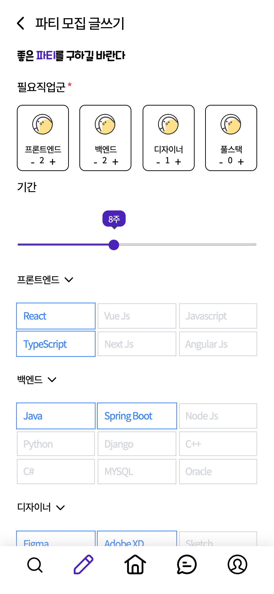 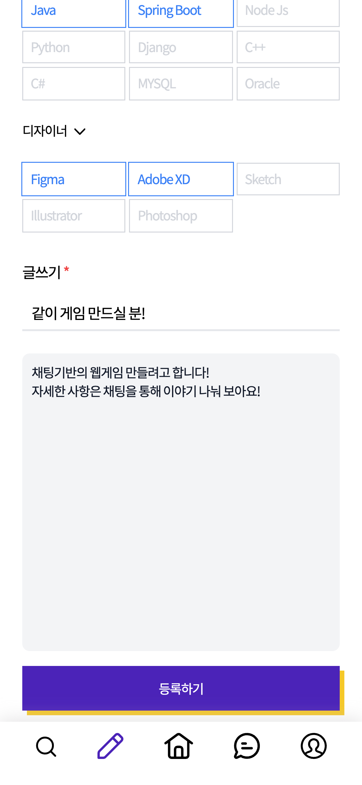

- 모집 게시글 작성시 원하는 기술 스택과 함께 필요한 인원을 설정하여 참여할 인원들이 프로젝트 내용에 대해 확인 할 수 있도록 합니다.

---

**모집 요청 시 알림과 팀원**

 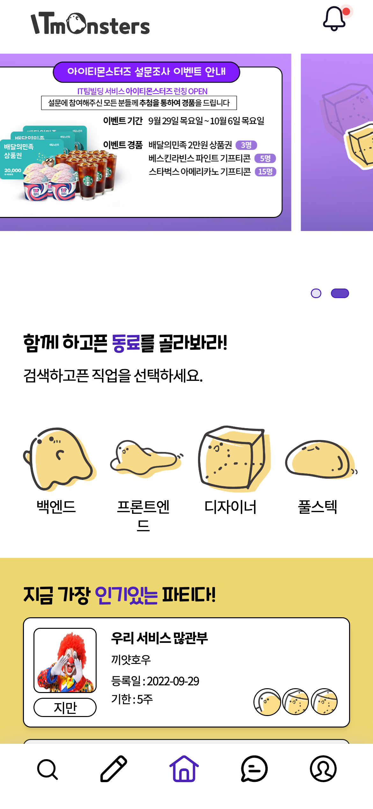  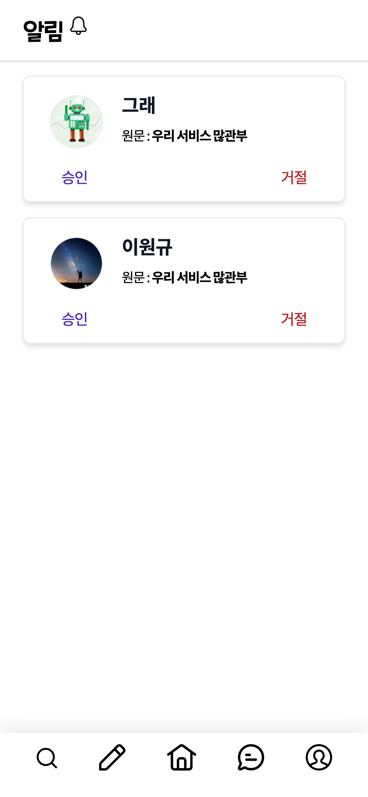  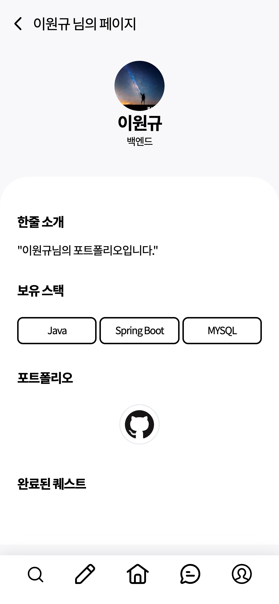

- 요청된 게시글에 지원요청을 알림을 통해 확인이 가능하며 개인페이지의 참여자의 보유 기술 스택 및 포트폴리오 확인 가능합니다.
- 게시글 작성자는 확인한 정보를 통해 승인과 거절을 할 수 있습니다.

---

**실시간 채팅기능**

 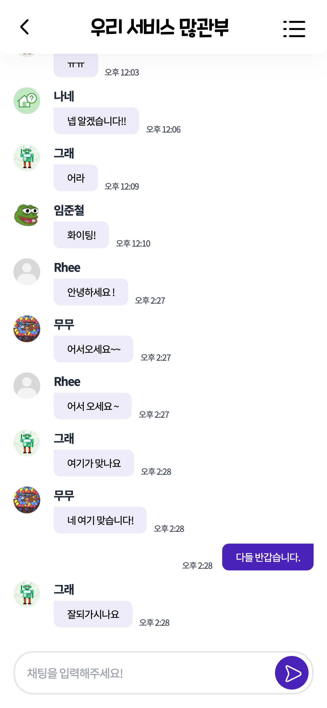  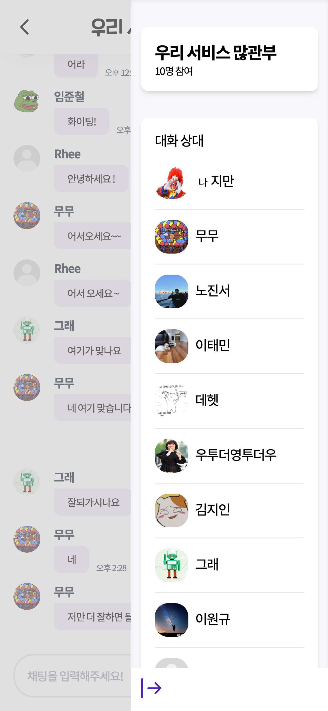

- 승인을 통해 가입된 팀원은 채팅창에 참여할 수 있습니다.
- 참가중인 멤버를 확인 할 수 있고 프로필을 통해 참가중인 멤버의 개인 페이지와 보유 기술스택 포트폴리오등을 확인 가능합니다.
- 나가기 버튼을 통해 프로젝트팀에서의 도중하차 결정을 내릴 수 있습니다.

---

**게시글 검색기능 및 필터**

 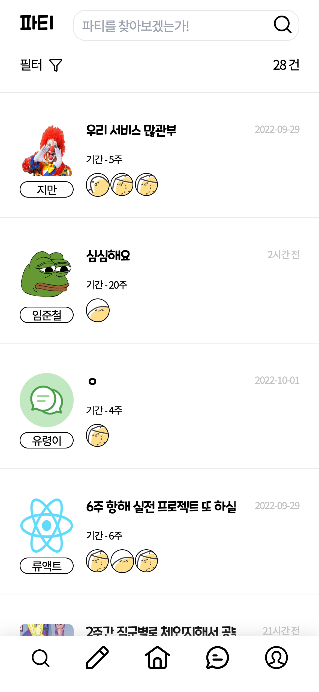  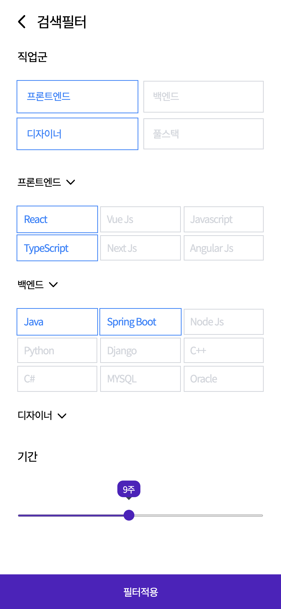  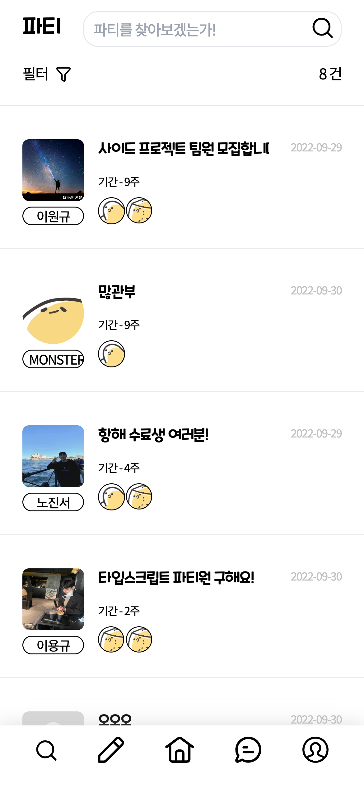

- 적용된 필터를 통한 빠른 검색이 가능합니다.

 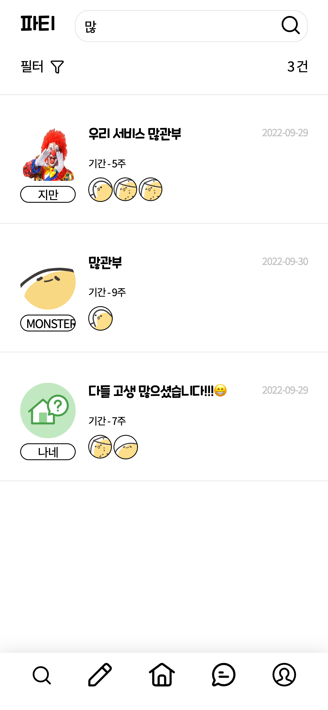 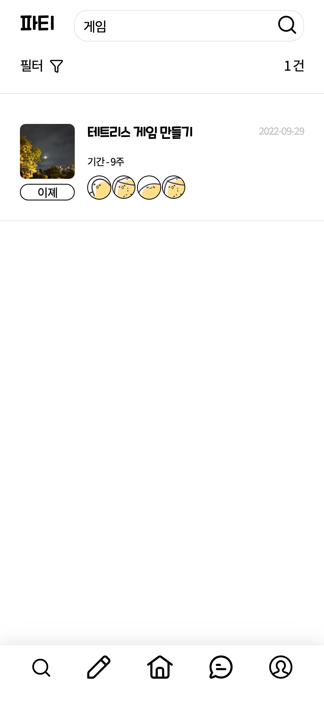

- 제목으로 모집 게시글 검색이 가능합니다.

# 3. 팀원 개별 소개

---

프로젝트 기획/ API 설계/ 테이블 및 Entity 설계

백엔드

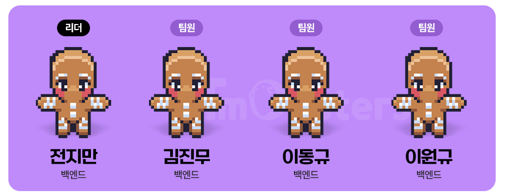

| 역할 | 이름 | 담당 |
| --- | --- | --- |
| BackEnd (Project Leader) | 전지만 | 1. 프로젝트 Skeleton Code 작성, 회원관리 API (JWT + Spring Security) 2.Deploy 환경 구축 및 서버 환경 관리 (AWS route53, ACM , EC2, CodeDeploy,Nginx)  3.Jmeter 서버 부하테스트    4.Oauth2 활용 KAKAO 로그인 |
   | BackEnd | 김진무 | 1. 댓글 CRUD 2.ID, PW 찾기 |
   | BackEnd | 이동규 | 1. 합류요청 및 팀원관리 CRUD 2.QueryDSL을 활용한 필터링 검색기능 구현 3.OAuth2 활용 google 로그인 4.Jmeter 부하테스트 |
   | BackEnd | 이원규 | 1. 게시글(퀘스트) CRUD 2.WebSocket 활용한 실시간 채팅 기능 구현 3.SSE를 활용한 실시간 알림기능 구현 4.Redis를 통한 데이터 캐싱    5.Oauth2 활용 Naver 로그인 |

|  | 이름 | 깃허브 | 블로그 |
| --- | --- | --- | --- |
| BE | 전지만 | https://github.com/Camof1ow | https://camof1ow.tistory.com/ |
| BE | 김진무 | https://github.com/kimjinmoo91 | https://catalia-144000.tistory.com/ |
| BE | 이동규 | https://github.com/dds1q | https://ddsiq.tistory.com |
| BE | 이원규 | https://github.com/oneqrhee | https://www.notion.so/695b8219cb3347b998e1a152921f8eaf |
